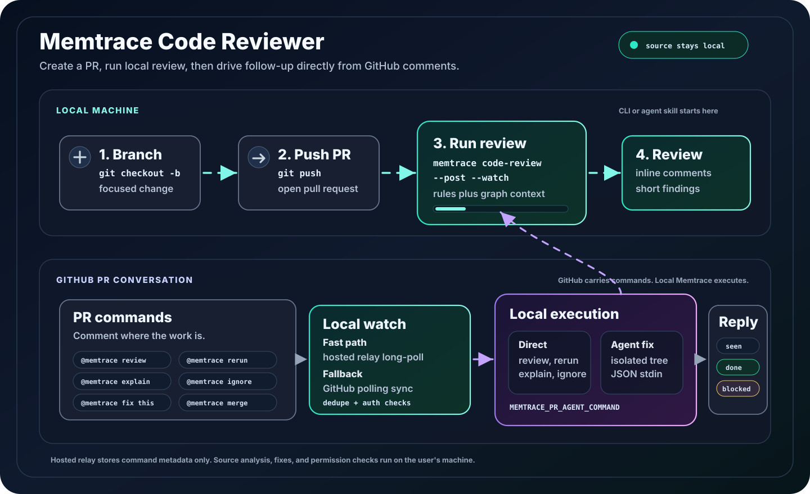

# Memtrace Code Reviewer

Memtrace can review GitHub pull requests using the same local code graph your
agents use while coding. It can run from the CLI or through an agent skill.
Either way, analysis happens on your machine.



## The Short Version

1. Make sure the repository is indexed locally.
2. Make a feature branch and open a GitHub pull request.
3. Run `memtrace code-review --post --watch` on the PR.
4. Keep a local Memtrace owner running for watched commands: `memtrace start`,
   a headless daemon, or an active `memtrace mcp` session.
5. Reply on GitHub with `@memtrace ...` commands when you want a rerun,
   explanation, ignore, local fix, or merge attempt.

```bash
# If this repo is not indexed yet:
memtrace index .

git checkout -b feat/my-change
# make your change
git add .
git commit -m "Add my change"
git push -u origin feat/my-change

gh pr create --fill

memtrace code-review \
  --pr https://github.com/OWNER/REPO/pull/123 \
  --post \
  --watch \
  --repo-root "$PWD"
```

## What Runs Where

Memtrace has four moving parts in the review flow:

| Part | Where it runs | What it does |
|---|---|---|
| Review engine | Your machine | Reads the PR diff, local checkout, AST rules, YAML rules, and indexed graph. |
| GitHub App | GitHub + Memtrace auth service | Lets Memtrace post review comments and read PR replies. |
| Watch loop | Your machine | Picks up `@memtrace` commands and executes them locally. |
| Optional fix agent | Your machine | Applies `@memtrace fix this` in an isolated worktree when a supported local agent is available. |

The hosted service does not run fixes and does not need your local repo path.
It only helps route GitHub App auth and, where available, relay relevant
`@memtrace` PR comments to your local Memtrace process.

## Before Reviewing a PR

This guide assumes Memtrace is already installed. If you are setting up a new
machine, use [`getting-started.md`](getting-started.md) first.

For code review, the important checks are repository-specific:

- The local checkout points at the same repository as the PR.
- The PR branch or PR head is checked out locally.
- The repository has been indexed by Memtrace.
- The Memtrace GitHub App is installed on that GitHub repository.
- Use `--post --watch` when you want `@memtrace` PR comments to work.
- Keep one local Memtrace owner running while you expect commands to
  execute: `memtrace start`, the headless daemon service, or an active
  `memtrace mcp` process.

Useful checks:

```bash
memtrace status
memtrace code-review --help
memtrace pr status
```

## Review a PR from the CLI

Use preview mode first when you want to see what Memtrace would post:

```bash
memtrace code-review --pr https://github.com/OWNER/REPO/pull/123
```

Post review comments:

```bash
memtrace code-review \
  --pr https://github.com/OWNER/REPO/pull/123 \
  --post \
  --repo-root "$PWD"
```

Post and keep watching the PR for commands:

```bash
memtrace code-review \
  --pr https://github.com/OWNER/REPO/pull/123 \
  --post \
  --watch \
  --repo-root "$PWD" \
  --repo-id Memtrace
```

Use `--repo-id` when your indexed repository id is not the folder name. Use
`--graph-mode off` only when you intentionally want AST/rule-only review.

## Review a PR from an Agent

After installing Memtrace skills, ask your agent in normal language. The
`memtrace-code-review` skill tells the agent to use the Memtrace PR review
tool instead of manually reading diffs.

Good prompts:

```text
Create a feature branch for the timeline border fix, commit it, push a PR,
then run Memtrace code review and post the review comments.
```

```text
Review this PR with Memtrace and post findings:
https://github.com/OWNER/REPO/pull/123
```

```text
Use Memtrace to review the current PR, watch it, and tell me what to reply
with if I want a fix.
```

Agent support has two layers:

| Capability | Claude Code | Codex | Cursor | Gemini CLI | Other MCP agents |
|---|---:|---:|---:|---:|---:|
| Memtrace skills + MCP | yes | yes | yes | yes | yes |
| Review, rerun, explain, ignore | yes | yes | yes | yes | yes |
| Automatic `fix this` | auto | auto | auto after login | auto | custom adapter |

The reviewer itself is editor-independent. Automatic local fixes use whichever
supported headless agent is available on the machine running Memtrace.

## GitHub Commands

When a PR is watched, comment on the PR or reply to a Memtrace inline review
comment.

| Command | Use it when | Notes |
|---|---|---|
| `@memtrace review` | You want a fresh review. | Same as rerun. |
| `@memtrace rerun` | New commits landed or you changed ignore state. | Posts a new review if findings remain. |
| `@memtrace explain` | You want a short explanation of a finding. | Best as a reply to a Memtrace inline comment. |
| `@memtrace ignore` | The finding is not useful for this PR. | Best as a reply to a Memtrace inline comment. Future reviews suppress that finding. |
| `@memtrace fix this` | You want a local agent to fix one finding. | Uses the detected local headless agent. Same-repo PR branches only in the first version. |
| `@memtrace merge` | You want Memtrace to ask GitHub to merge the PR. | GitHub still enforces branch protection, checks, and app permissions. |

Memtrace reacts with eyes when a command is picked up. It removes that
acknowledgement when the command completes, then reacts with `+1` on success or
`confused` when it needs attention. It also posts a short reply on GitHub.

If a command does not run immediately, force a sync:

```bash
memtrace pr sync
memtrace pr status
```

## Automatic Fixes

For `@memtrace fix this`, Memtrace creates an isolated worktree, asks a local
headless agent to make the narrow edit, then commits and pushes the result back
to the PR branch.

For normal use, there is nothing else to configure. If Codex, Claude Code,
Cursor Agent, or Gemini CLI is installed and authenticated, Memtrace can detect
it automatically.

```bash
memtrace code-review \
  --pr https://github.com/OWNER/REPO/pull/123 \
  --post \
  --watch \
  --repo-root "$PWD"
```

Then reply to a Memtrace inline review comment:

```text
@memtrace fix this
```

If multiple supported agents are installed, choose one explicitly:

```bash
MEMTRACE_PR_AGENT_PROVIDER=codex \
  memtrace code-review \
    --pr https://github.com/OWNER/REPO/pull/123 \
    --post \
    --watch
```

Supported provider values are `codex`, `claude`, `cursor`, and `gemini`.
Cursor may require `cursor agent login` first.

For other headless agents, use a custom adapter:

```bash
export MEMTRACE_PR_AGENT_COMMAND="/path/to/your-agent-wrapper"
```

That wrapper receives the PR context as JSON on stdin. Most users should not
need this.

## Typical Feature Workflow

Use this when you want a clean branch, PR, and review cycle.

```bash
# 1. Start from current main
git checkout main
git pull --ff-only

# 2. Create a focused branch
git checkout -b feat/descriptive-name

# 3. Ask your agent to implement the change, or do it yourself
# Example prompt:
# "Use Memtrace first, implement the dashboard empty state, add focused tests."

# 4. Commit and push
git add .
git commit -m "Add dashboard empty state"
git push -u origin feat/descriptive-name

# 5. Open a PR
gh pr create --fill

# 6. Run Memtrace review
memtrace code-review \
  --pr https://github.com/OWNER/REPO/pull/123 \
  --post \
  --watch \
  --repo-root "$PWD"

# 7. Use GitHub comments for follow-up
# @memtrace explain
# @memtrace fix this
# @memtrace rerun
```

## What Memtrace Looks For

The reviewer combines several local signals:

- AST review detectors for high-confidence bug patterns.
- YAML rule packs for language and framework issues.
- Cross-module graph checks when `--graph-mode strict` is enabled.
- Local repository context from the indexed Memtrace graph.

It is not a generic style bot. It tries to post fewer, higher-signal findings.

## Offline Benchmark Snapshot

On the 50-PR offline code-review corpus, Memtrace is ranked first by 3-judge
mean F1. The judges were GPT-5.2, Claude Sonnet 4.5, and Claude Opus 4.5.

| Rank | Tool | 3-judge mean F1 |
|---:|---|---:|
| 1 | Memtrace | **0.7268** |
| 2 | Cubic v2 | 0.6077 |
| 3 | Qodo Extended v2 | 0.5546 |
| 4 | Augment | 0.5214 |
| 5 | Qodo Extended Summary | 0.4960 |
| 6 | Mergemonkey | 0.4691 |
| 7 | Qodo v22 | 0.4686 |
| 8 | Qodo v2 | 0.4650 |
| 9 | Bugbot | 0.4438 |

Against Cubic v2:

- Memtrace: `0.726757`
- Cubic v2: `0.607655`
- Absolute lead: `+0.119102`
- Relative lead: **`+19.60%`**

Machine-readable snapshot:
[`benchmarks/code-reviewer-offline-results.json`](../benchmarks/code-reviewer-offline-results.json).

## What Has To Be Running

The normal workflow is agent-first:

1. Start Memtrace in the repo.
2. Ask your agent to make the branch, open the PR, and run Memtrace review.
3. Use `@memtrace ...` commands on GitHub.

The agent can be Claude Code, Codex, Gemini CLI, Cursor, Hermes, Windsurf, or
another agent with a headless mode. Memtrace does the review locally; the agent
is only needed when you ask Memtrace to create or change code.

Things that can block the workflow:

- The repo has not been indexed on this machine.
- The local checkout is not the PR branch.
- The PR was not started with `--post --watch`.
- `@memtrace fix this` cannot find Codex, Claude Code, Cursor Agent, Gemini CLI,
  or a custom adapter.
- GitHub rejects a merge because checks, branch protection, or permissions fail.

For finding-specific commands, reply to the Memtrace inline review comment:
`@memtrace explain`, `@memtrace ignore`, or `@memtrace fix this`.

For PR-wide commands, a normal PR comment is enough: `@memtrace rerun`,
`@memtrace review`, or `@memtrace merge`.

## Privacy

Review execution is local-first. Source analysis, graph traversal, and automatic
fixes run on your machine. GitHub receives normal PR review comments and command
replies because that is where the collaboration happens.

See [`privacy-and-telemetry.md`](privacy-and-telemetry.md) for the complete
privacy model.
